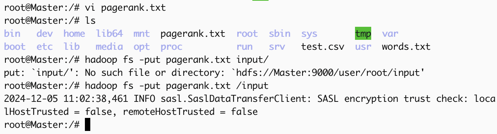
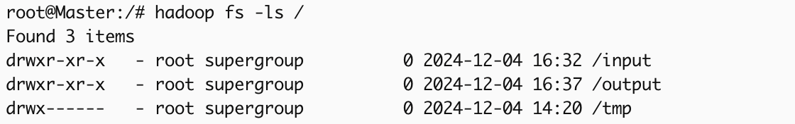
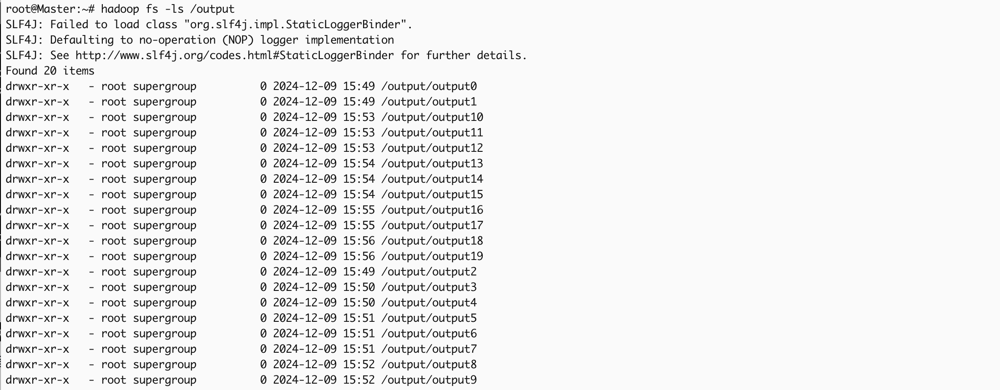

# 分布式MapReduce与Spark执行迭代应用PageRank的性能差异研究

# 小组分工

佟垚：贡献25%，负责spark实现PageRank算法，资料整理

刘子萌：贡献25%，负责map_reduce实现PageRank算法，资料整理

赵宣皓：贡献25%，负责搭建hadoop集群，执行PageRank任务，资料整理

严思雨：贡献25%，负责搭建spark集群，执行PageRank任务，git仓库管理

# 研究目的

本研究旨在对比分布式计算框架Spark和MapReduce在执行迭代应用PageRank算法时的性能差异。PageRank是一种用于网页排名的算法，广泛应用于搜索引擎和网络分析。由于其迭代计算的特性，选择合适的分布式计算框架对其性能有重要影响。本研究的目标是评估Spark和MapReduce在处理PageRank算法时的效率和资源利用率。

# 研究方法

## 实验环境

### **集群配置**

**节点设置**：启动三个容器作为集群的三个节点，并为每个节点配置4G内存。

- **Master节点**：负责资源管理和任务调度。
- **Slave1节点**：作为工作节点之一。
- **Slave2节点**：作为工作节点之一。

**网络配置**：使用Docker桥接模式创建了一个172.19.0.0/16的子网，各节点通过桥接模式连接。

### **软件配置**

**操作系统**：Ubuntu 22.04，作为容器的基础镜像，提供稳定和兼容的运行环境。

**Docker**：版本27.3.1，用于容器化Hadoop和Spark集群，简化部署和管理。

**JDK**：版本1.8，确保Hadoop和Spark的运行环境的兼容性。

**Hadoop**：版本3.1.2，作为分布式存储和MapReduce计算框架。

**Spark**：版本3.1.2，作为内存计算框架。

### 数据集选择

mini-web-google.txt

## 算法实现

### **编写MapReduce程序**

**定义Mapper和Reducer类**：编写Java类来定义Mapper和Reducer的逻辑。Mapper用于处理输入数据并生成中间键值对，Reducer用于处理Mapper生成的中间数据并生成最终输出。

**设置Job配置**：在主类中，设置MapReduce Job的配置，包括输入输出路径、Mapper和Reducer类、输出键值对的类型等。

### **编写Spark程序**

**加载数据**：使用Spark的textFile方法从存储系统（如HDFS或本地文件系统）加载数据，创建初始的RDD（弹性分布式数据集）。

**定义计算逻辑**：利用RDD的各种转换（如map, flatMap, reduceByKey等）和行动（如collect, saveAsTextFile等）操作来实现计算逻辑。

### **打包成jar文件**

**使用Maven**：使用Maven来管理项目依赖和构建过程，通过配置pom.xml文件，指定项目的依赖库和打包方式，将mapreduce程序和spark程序打包成可执行的jar包。

## **实验步骤**

### 上传HDFS

将PageRank的输入数据上传至Hadoop分布式文件系统（HDFS），并创建输入输出路径。

### **提交jar文件到Hadoop集群**

在Hadoop集群上运行MapReduce版本的PageRank算法，记录执行时间和资源使用情况。

**启动Hadoop集群**

**上传jar文件**：将生成的jar文件上传到Hadoop集群的主节点。

**使用Hadoop命令行工具提交任务**：通过命令行工具hadoop jar提交MapReduce作业。

### **提交jar文件到Spark集群**

在Spark集群上运行Spark版本的PageRank算法，记录执行时间和资源使用情况。

**启动Spark集群**

**上传jar文件**：将打包好的jar文件上传到Spark集群的主节点或其他适当的节点。

**使用spark-submit提交任务**：

- 通过spark-submit工具将jar文件提交到Spark集群。指定应用程序的主类、集群管理器（如YARN）、部署模式（client或cluster）、以及资源配置（如内存和CPU核心数）。
- spark-submit负责启动Driver程序，并管理任务的分发和执行。
    
    
    

# 研究结果

## 运行结果

**MapReduce：**

**Spark：**

## **性能指标**

- 执行时间：测量两种框架完成相同任务所需的总时间。
- 资源使用：监控CPU、内存等资源的消耗情况。

## 对比分析

### **执行时间**

**MapReduce**：执行时间为511027毫秒。

**Spark**：执行时间为35971毫秒。

**分析**：Spark在执行迭代应用PageRank时，表现出更快的执行时间。这主要是因为Spark通过内存计算的方式减少了磁盘I/O操作，这在迭代计算中具有显著优势。

### **资源使用**

**MapReduce：**

**Spark：**

- **CPU使用**
    - **MapReduce**: CPU使用率在执行Map和Reduce任务时可能较高，但由于频繁的磁盘I/O，CPU可能会有空闲等待时间。
    - **Spark**: 由于数据在内存中处理，Spark的CPU使用率通常较高且更为持续，因为减少了因磁盘I/O造成的等待时间。
- **内存使用**
    - **MapReduce**: 由于MapReduce在每次迭代后需要将中间结果写入磁盘，因此内存使用相对较低。然而，这种磁盘I/O操作增加了计算的延迟和资源消耗。
    - **Spark**: 利用内存进行数据处理和存储，通过RDD（弹性分布式数据集）来保存中间结果，减少了磁盘I/O操作。因此，Spark的内存使用较高，但这也带来了更快的计算速度和更低的延迟。
- **网络带宽**
    - **MapReduce**: 在Shuffle阶段需要大量的数据传输，可能会造成网络带宽的瓶颈。
    - **Spark**: 通过DAG优化和数据本地化策略，Spark减少了不必要的数据传输，优化了网络带宽的使用。
- **磁盘I/O**
    - **MapReduce**: 高频的磁盘读写操作是MapReduce的典型特征。这是因为每个Map和Reduce阶段都需要将数据写入和读取磁盘，导致较高的磁盘I/O。
    - **Spark**: 通过在内存中处理数据，Spark显著减少了对磁盘的依赖，降低了磁盘I/O操作的频率。

### 总结

- **执行效率**
    - Spark在集群节点之间的通信开销较小，适合需要频繁迭代计算的应用。
    - MapReduce的优势在于其成熟的生态系统和对大规模批处理任务的良好支持，但在迭代计算场景中不如Spark高效。
- **Job执行过程**
    - **MapReduce**
        
        采用YARN架构，ResourceManager负责资源管理和任务调度，NodeManager负责节点上的容器管理，ApplicationMaster负责任务调度和执行。
        
        数据处理分为Mapper任务的映射逻辑处理和Reducer任务的归约逻辑处理。
        
    - **Spark**
        
        由Driver程序负责任务调度和协调，生成执行计划，并与集群管理器通信以分配资源。
        
        Executors在集群节点上运行，执行具体的任务并处理数据，使用DAG优化任务执行计划。